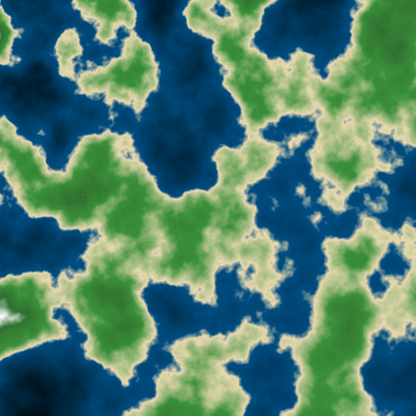
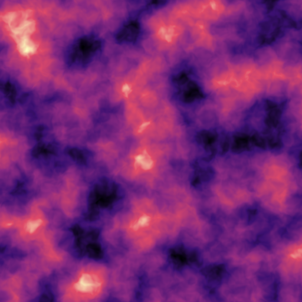
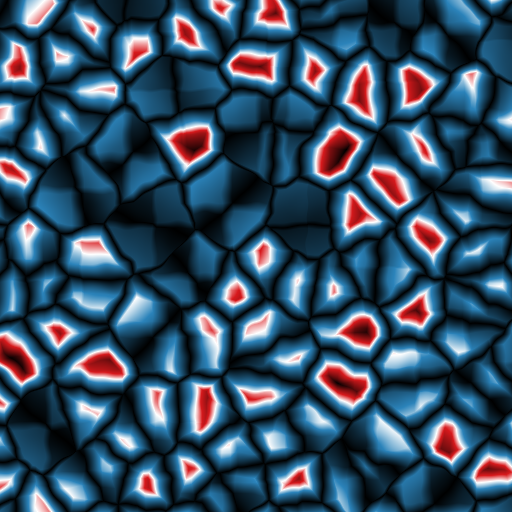
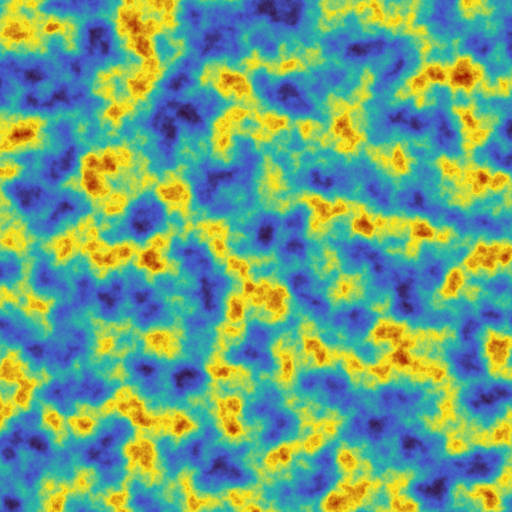
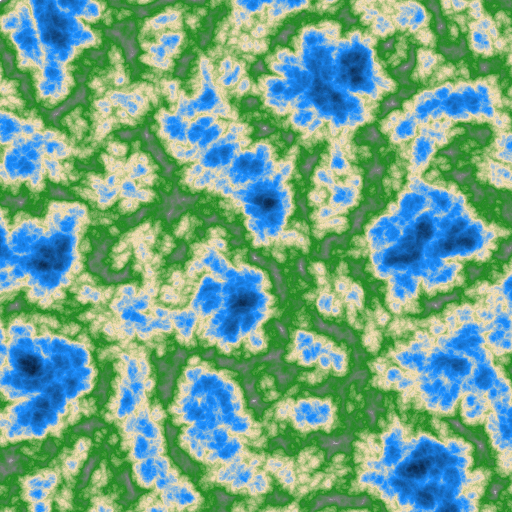
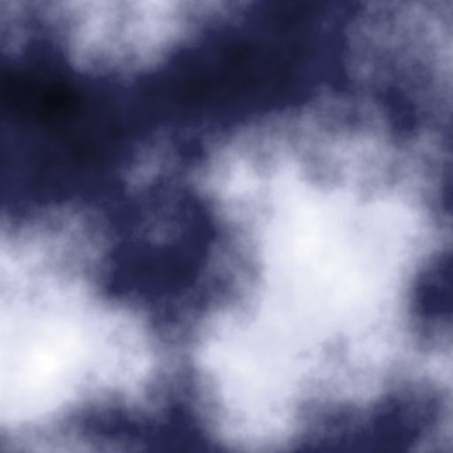
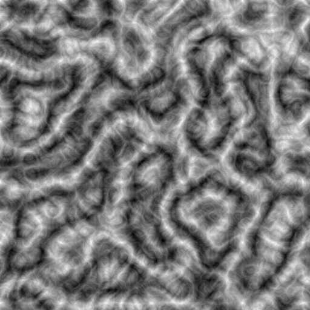

# noise

2D noise image generator, written in C++.

    
   

Supported output formats:

* **PNG** (`.png`) lossless.
* **JPEG** (`.jpg` / `.jpeg`) lossy (quality is fixed at 95).
* **PPM** (`.ppm`) binary P6.

## Compile and run the program

You need a C++17 compiler and CMake.

Build:

$ cmake -S . -B build
$ cmake --build build -j

Run:

$ ./noise --out out.png

For additional options pass `--help` (or `--h`):

$ ./noise --help

## Quick examples

Perlin heightmap with terrain colors:

$ ./noise --type Perlin --width 1024 --height 1024 --seed 123 --colormap terrain --out h.png

Tileable texture (seamless edges):

$ ./noise --type OpenSimplex2S --tile --tile-period 1024 --out tile.png

Cellular noise (switch return type):

$ ./noise --type Cellular --cell-return CellValue --out cell.jpg

Domain warp:

$ ./noise --warp --warp-amp 2.0 --warp-fractal-type DomainWarpProgressive --warp-octaves 4 --out warped.png

Max-contrast mapping and CSV dump:

$ ./noise --normalize minmax --csv out.csv --out out.png

## Core options

Sampling / output size:

* `--width <int>` (default `512`)
* `--height <int>` (default `512`)
* `--seed <int>` (default `0`)
* `--freq <float>` (default `0.01`)
* `--scale <float>` alias for `--freq`
* `--z <float>` (default `0`)
  * If `--z != 0`, the tool samples **3D noise** at `(x, y, z)`; otherwise it samples 2D noise at `(x, y)`.

Noise type:

* `--type <OpenSimplex2|OpenSimplex2S|Perlin|Value|ValueCubic|Cellular>` (default `Perlin`)
* `--type simplex` is accepted as an alias for `OpenSimplex2S`.

3D rotation:

* `--rotation3d <None|ImproveXYPlanes|ImproveXZPlanes>` (default `None`)
  * This mainly matters for 3D noise and 3D warp, but it’s safe to use anytime.

## Tileable textures

* `--tile` (default off)
  * Forces the texture to repeat seamlessly.
* `--tile-period <int>` (default `width`)
  * Repeat period in pixels. Smaller periods repeat more often within the same image.

How tiling works:

* The tool uses a deterministic 4-sample blend so that the output repeats **exactly** every `tile-period` pixels.
* For the cleanest “wrap both axes” texture, use a square image and set `--tile-period` equal to the image width.

## Fractal settings (main noise)

* `--fractal-type <None|FBm|Rigid|PingPong>` (default `None`)
* `--octaves <int>` (default `5`)
* `--gain <float>` (default `0.5`)
* `--lacunarity <float>` (default `2.0`)
* `--weighted-strength <float>` (default `0.0`)
* `--pingpong-strength <float>` (default `2.0`) (only meaningful for `PingPong`)

Notes:

* These configure FastNoiseLite’s fractal mode for the *main*  noise sampler.
* If `--fractal-type None`, the other fractal parameters do not change the output.

## Cellular-only options

These only affect output when `--type Cellular`:

* `--cell-dist <Euclidean|EuclideanSq|Manhattan|Hybrid>` (default `Euclidean`)
* `--cell-return <CellValue|Distance|Distance2|Distance2Add|Distance2Sub|Distance2Mul|Distance2Div>` (default `Distance`)
* `--cell-jitter <float>` (default `1.0`)

## Domain warp

* `--warp` (default off)
  * Enables domain warp (warps the sampling coordinates before sampling the main noise).
* `--warp-type <OpenSimplex2|OpenSimplex2Reduced|BasicGrid>` (default `OpenSimplex2`)
  * `OpenSimplex2Reduced` maps to FastNoiseLite’s `OpenSimplex2S`.
  * `BasicGrid` maps to FastNoiseLite’s `Value` (cheap grid-like warp).
* `--warp-amp <float>` (default `1.0`)
  * Warp amplitude (how far coordinates get pushed).
* `--warp-seed <int>` (default `seed + 1`)
* `--warp-freq <float>` (default same as `--freq`)
* `--warp-rotation3d <None|ImproveXYPlanes|ImproveXZPlanes>` (default same as `--rotation3d`)

Warp fractal modes:

* `--warp-fractal-type <None|DomainWarpProgressive|DomainWarpIndependent>` (default `None`)
* `--warp-octaves <int>` (default `3`)
* `--warp-gain <float>` (default `0.5`)
* `--warp-lacunarity <float>` (default `2.0`)

Tile + warp:

* If `--tile` and `--warp` are both enabled, warp sampling is also forced to be tileable using the same `--tile-period`.

## Normalization (value → t in [0,1])

FastNoiseLite outputs floats; images need bytes. The tool converts sampled values to `t ∈ [0,1]` before colormapping.

* `--normalize <fixed|minmax>` (default `fixed`)

Modes:

* `fixed`:
  * `t = clamp(v * 0.5 + 0.5, 0..1)`
  * Predictable across runs / settings.
* `minmax`:
  * Computes `minV`/`maxV` over the entire image, then:
  * `t = (v - minV) / (maxV - minV)`
  * Maximum contrast for the current output.

## Colormap

Single unified flag:

* `--colormap <spec>` (default `grayscale`)

Presets:

* `grayscale`
* `terrain`
* `viridis`
* `magma`
* `turbo`
* `icefire`

Stops (inline gradient):

--colormap "stops:0:#000000,0.45:#1e90ff,0.6:#f5deb3,1:#ffffff"

* Stops are `pos:color` pairs where `pos` is in `[0,1]`.
* Colors are hex `#RRGGBB`.
* Colors between stops are linearly interpolated in RGB.

Ramp image file:

--colormap "file:ramp.png"

* Expects an image that is **Nx1** or **1xN**.
* The ramp is sampled along the long axis by `t`.

JSON gradient file:

--colormap "json:ramp.json"

Format:

```json
{
  "stops": [
    { "pos": 0.0, "color": "#000000" },
    { "pos": 0.5, "color": "#00ff00" },
    { "pos": 1.0, "color": "#ffffff" }
  ]
}

Output files
--out <path> (default out.png)

--format <png|jpg|jpeg|ppm> (optional)

If omitted, the tool infers format from --out extension.

If extension is unknown, it defaults to png.

CSV output
--csv <path.csv> (optional)

CSV contents:

Dumps the normalized t values in [0,1] (the same values used for colormap/image mapping).

One row per image row, comma-separated.

Third-party

FastNoiseLite: third_party/FastNoiseLite.h

stb:

third_party/stb_image_write.h (PNG/JPEG writing)

third_party/stb_image.h (ramp image loading)

::contentReference[oaicite:0]{index=0}